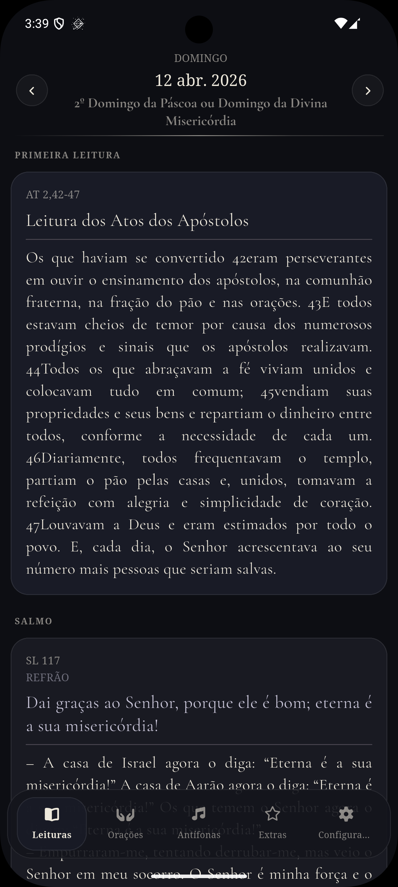
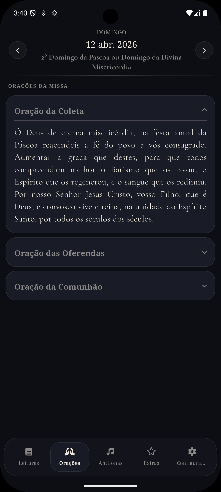

# Liturgia App

O **Liturgia App** é um aplicativo Flutter desenvolvido para fornecer acesso simples, rápido e offline à liturgia católica diária.
O foco do projeto é oferecer uma experiência fluida mesmo sem conexão com a internet, utilizando cache local e sincronização inteligente.

---

## Preview

<p align="center">
  
  
</p>

---

## Funcionalidades

* Liturgia diária completa (orações, leituras, antífonas e extras)
* Navegação por abas organizada
* Notificações diárias configuráveis
* Modo offline-first com cache automático
* Tema escuro otimizado para leitura
* Sincronização automática baseada em conectividade

---

## Personalização do Usuário

O aplicativo permite que o usuário adapte a experiência de leitura e o comportamento do app:

* Ajuste dinâmico do tamanho da fonte
* Modo de leitura contínua (conteúdo expandido automaticamente)
* Exibição opcional de referências bíblicas
* Controle de cache offline:

  * Definição de dias anteriores salvos
  * Pré-carregamento de dias futuros
* Configuração de notificações:

  * Ativação/desativação
  * Escolha do horário do lembrete
* Gerenciamento de dados:

  * Limpeza manual de cache
  * Redefinição completa das preferências

As configurações são persistidas localmente e aplicadas em tempo real na interface.

---

## Arquitetura

O aplicativo utiliza uma arquitetura baseada em separação de camadas, inspirada em Clean Architecture e no padrão MVVM.

### Camadas

* **Presentation**

  * UI (pages, tabs, widgets)
  * ViewModels (gerenciamento de estado com Provider)

* **Data**

  * Repositories (orquestração de dados)
  * Services (API)
  * DAOs (acesso ao banco local)
  * Models

* **Core**

  * Configurações globais
  * Tema
  * Navegação
  * Utilitários
  * Widgets reutilizáveis

---

## Estrutura do Projeto

```
lib/
├── main.dart
├── core/
│   ├── constants/
│   ├── database/
│   ├── exceptions/
│   ├── extensions/
│   ├── network/
│   ├── router/
│   ├── theme/
│   ├── utils/
│   └── widgets/
├── data/
│   ├── daos/
│   ├── models/
│   ├── repositories/
│   ├── services/
│   └── tables/
└── presentation/
    ├── pages/
    ├── tabs/
    ├── viewmodels/
    └── widgets/
```

---

## Tecnologias Utilizadas

* Flutter
* Provider
* Go Router
* Drift (SQLite)
* HTTP
* Flutter Local Notifications
* Timezone
* Connectivity Plus
* Flutter SVG
* Package Info Plus

---

## Desafios Técnicos

* Implementação de estratégia offline-first com fallback automático entre API e banco local
* Persistência e sincronização de dados utilizando Drift (SQLite)
* Agendamento de notificações respeitando limitações do Android (exact alarms)
* Sincronização automática ao recuperar conexão com a internet
* Separação de responsabilidades entre camadas para evitar acoplamento

---

## Como Executar

```bash
git clone https://github.com/ThiagoTA/LiturgiaApp.git
cd liturgia-app
flutter pub get
flutter run
```

---

## Objetivo do Projeto

Este projeto foi desenvolvido com foco em:

* Organização de código escalável
* Aplicação de boas práticas de arquitetura
* Simulação de cenários reais de aplicações mobile
* Experiência consistente mesmo sem conexão

---

## Observações

* O app utiliza armazenamento local para reduzir dependência de rede
* Notificações funcionam localmente, sem necessidade de backend
* Projeto desenvolvido com foco em portfólio e estudo

---

## Autor

Desenvolvido por **Thiago**
